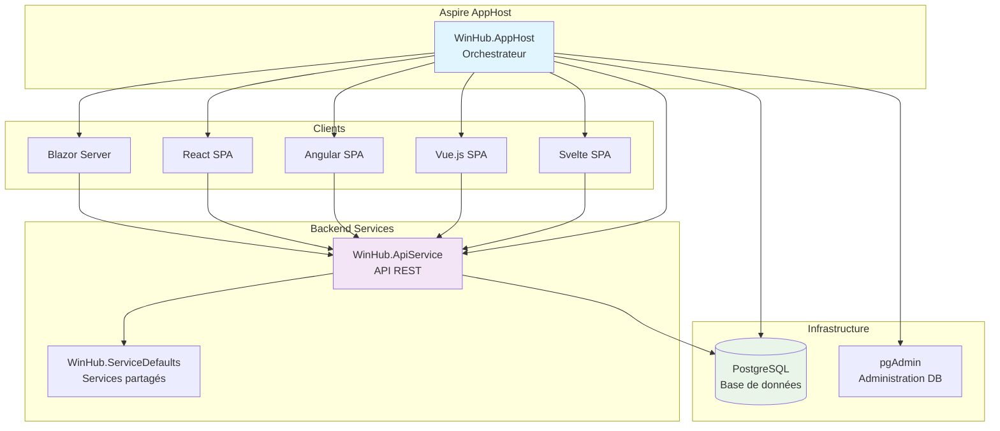
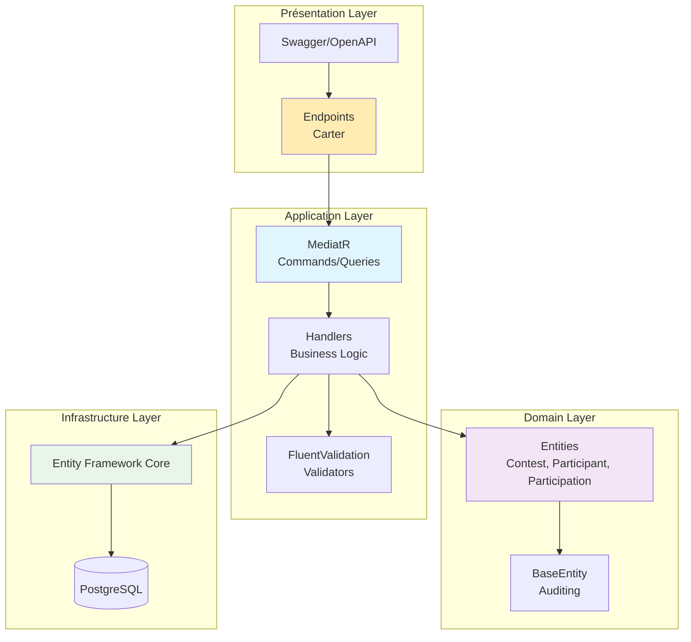
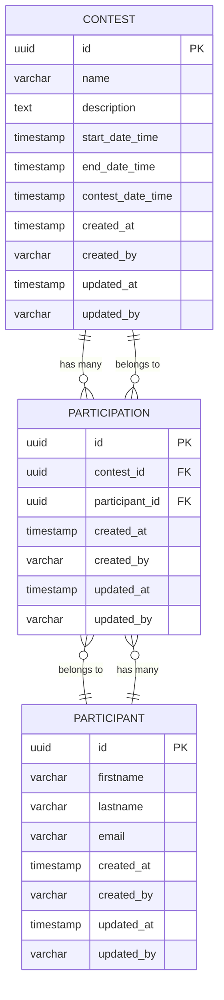
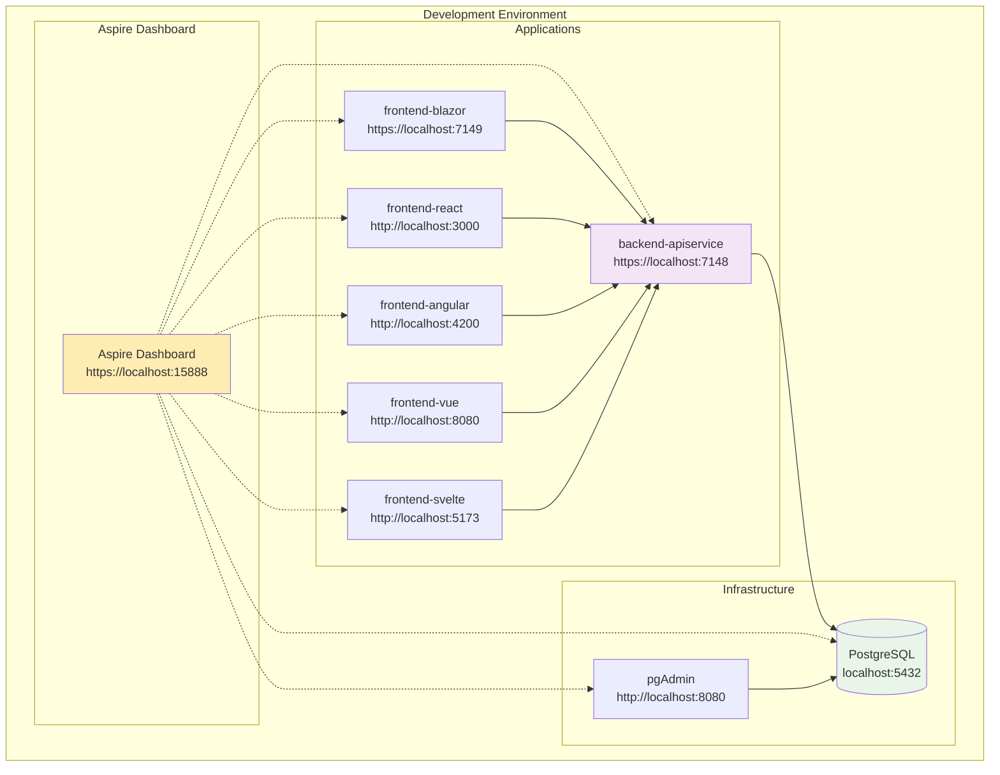
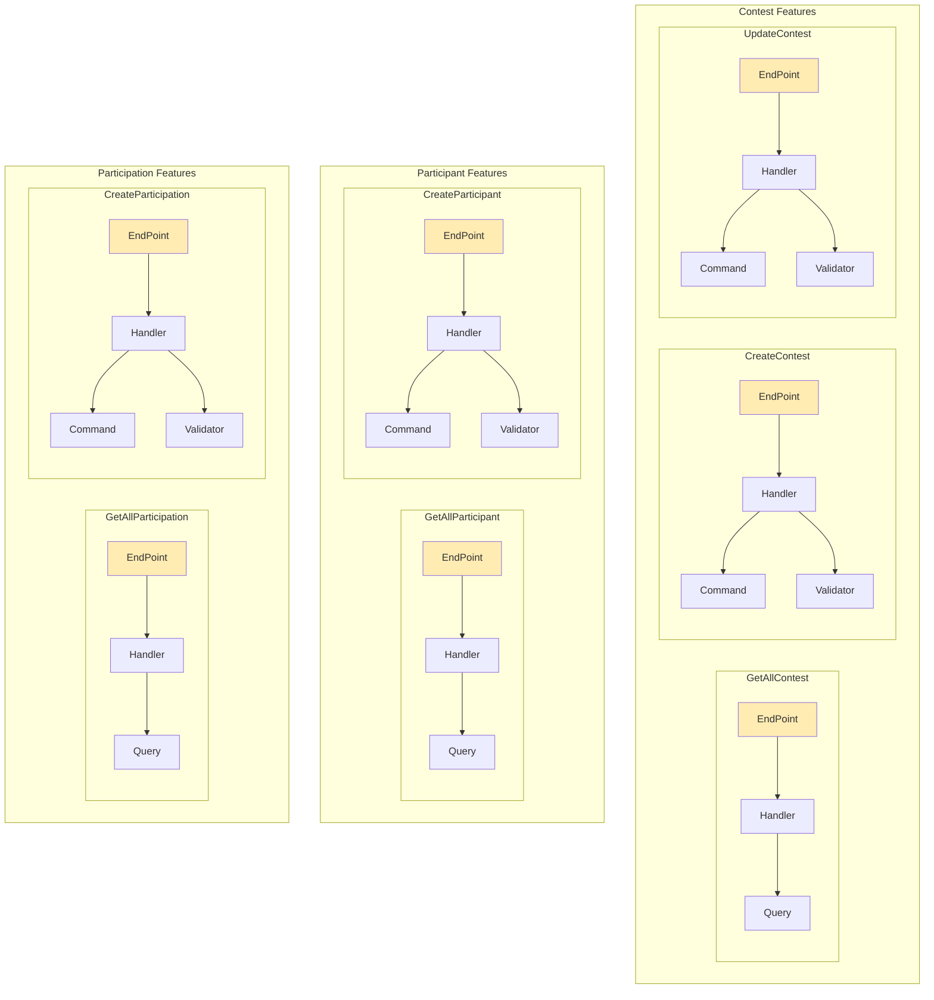
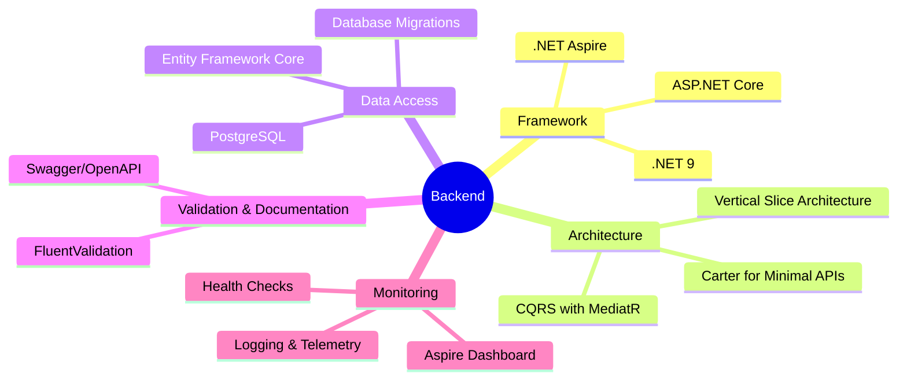
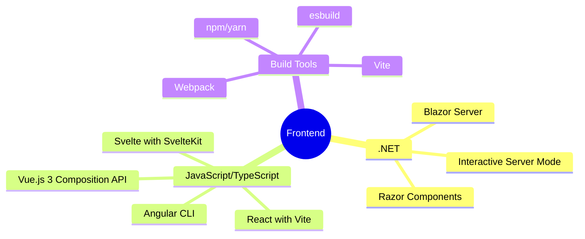
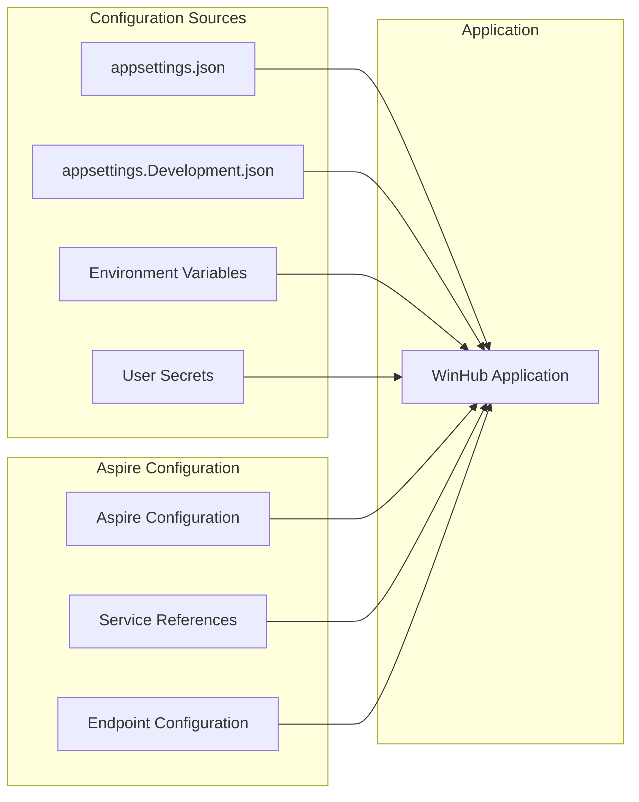
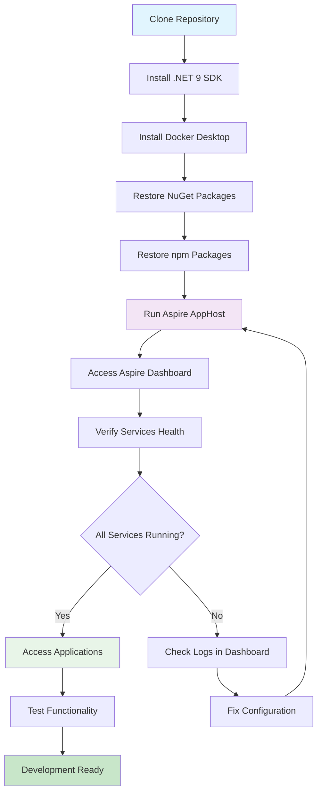

# Documentation du Projet WinHub

## Table des matières

1. [Vue d'ensemble](#vue-densemble)
2. [Architecture de l'application](#architecture-de-lapplication)
3. [Modèle de données](#modèle-de-données)
4. [Architecture technique](#architecture-technique)
5. [Technologies utilisées](#technologies-utilisées)
6. [Configuration et déploiement](#configuration-et-déploiement)

## Vue d'ensemble

**WinHub** est une application de gestion de tirages au sort développée avec .NET Aspire. Elle permet de créer et gérer des concours avec des participants qui peuvent avoir plusieurs participations.

### Objectifs du projet

- Expérimenter la plateforme **.NET Aspire**
- Démontrer l'interopérabilité entre différentes technologies frontend
- Implémenter une architecture moderne et observalble
- Supporter plusieurs bases de données sans modification de code

### Fonctionnalités principales

- ✅ Création et gestion de concours (tirages au sort)
- ✅ Gestion des participants
- ✅ Gestion des participations
- ✅ Interface Blazor Server
- ✅ API REST avec Swagger
- ✅ Support multi-frontend (React, Angular, Vue.js, Svelte)

## Architecture de l'application

### Diagramme d'architecture globale



### Architecture en couches du backend



## Modèle de données

### Diagramme de classes des entités

```mermaid
classDiagram
    class BaseEntity~TKey~ {
        +TKey Id
        +DateTime CreatedAt
        +string CreatedBy
        +DateTime UpdatedAt
        +string UpdatedBy
    }
    
    class Contest {
        +Guid Id
        +string Name
        +string Description
        +DateTime StartDateTime
        +DateTime EndDateTime
        +DateTime ContestDateTime
        +ICollection~Participation~ Participations
    }
    
    class Participant {
        +Guid Id
        +string Firstname
        +string Lastname
        +string Email
        +ICollection~Participation~ Participations
    }
    
    class Participation {
        +Guid Id
        +Guid ContestId
        +Guid ParticipantId
        +Contest Contest
        +Participant Participant
    }
    
    BaseEntity~Guid~ <|-- Contest
    BaseEntity~Guid~ <|-- Participant
    BaseEntity~Guid~ <|-- Participation
    
    Contest ||--o{ Participation : "1 to many"
    Participant ||--o{ Participation : "1 to many"
    Participation }o--|| Contest : "many to 1"
    Participation }o--|| Participant : "many to 1"
```

### Diagramme entité-relation



## Architecture technique

### Diagramme de déploiement Aspire



### Architecture des fonctionnalités (Vertical Slice)



### Diagramme de flux des requêtes

```mermaid
sequenceDiagram
    participant C as Client (Frontend)
    participant E as Endpoint (Carter)
    participant M as MediatR
    participant H as Handler
    participant V as Validator
    participant DB as Database
    
    C->>+E: HTTP Request
    E->>+M: Send Command/Query
    M->>+H: Route to Handler
    
    alt Command (Create/Update/Delete)
        H->>+V: Validate Input
        V-->>-H: Validation Result
        
        alt Validation Success
            H->>+DB: Execute Operation
            DB-->>-H: Result
            H-->>-M: Success Response
        else Validation Failed
            H-->>-M: Validation Error
        end
    else Query (Read)
        H->>+DB: Execute Query
        DB-->>-H: Data
        H-->>-M: Query Result
    end
    
    M-->>-E: Response
    E-->>-C: HTTP Response (JSON)
```

## Technologies utilisées

### Backend Technologies



### Frontend Technologies



## Configuration et déploiement

### Variables d'environnement et configuration



### Étapes de déploiement



### Commandes de développement

```bash
# Démarrer l'application complète
dotnet run --project src/WinHub.AppHost

# Démarrer uniquement l'API
dotnet run --project src/backend/WinHub.ApiService

# Démarrer uniquement Blazor
dotnet run --project src/frontend/WinHub.Blazor

# Démarrer React
cd src/frontend/WinHub.React
npm start

# Démarrer Angular
cd src/frontend/WinHub.Angular
ng serve

# Démarrer Vue.js
cd src/frontend/WinHub.VueJS
npm run dev

# Démarrer Svelte
cd src/frontend/WinHub.Svelte
npm run dev
```

## Points clés de l'architecture

### Avantages de l'approche choisie

1. **Vertical Slice Architecture** : Chaque fonctionnalité est autonome et facile à maintenir
2. **CQRS avec MediatR** : Séparation claire entre les commandes et les requêtes
3. **Multi-frontend** : Démonstration de l'interopérabilité avec différentes technologies
4. **Aspire** : Orchestration simplifiée et observabilité intégrée
5. **Entity Framework Core** : Abstraction de la base de données permettant le changement facile de SGBD

### Extensibilité

Le projet est conçu pour être facilement extensible :

- Ajout de nouveaux frontends
- Support de nouvelles bases de données
- Ajout de fonctionnalités métier
- Intégration de services externes
- Déploiement sur différents environnements (Azure, AWS, etc.)

---

*Cette documentation est maintenue automatiquement et reflète l'état actuel du projet WinHub.*

